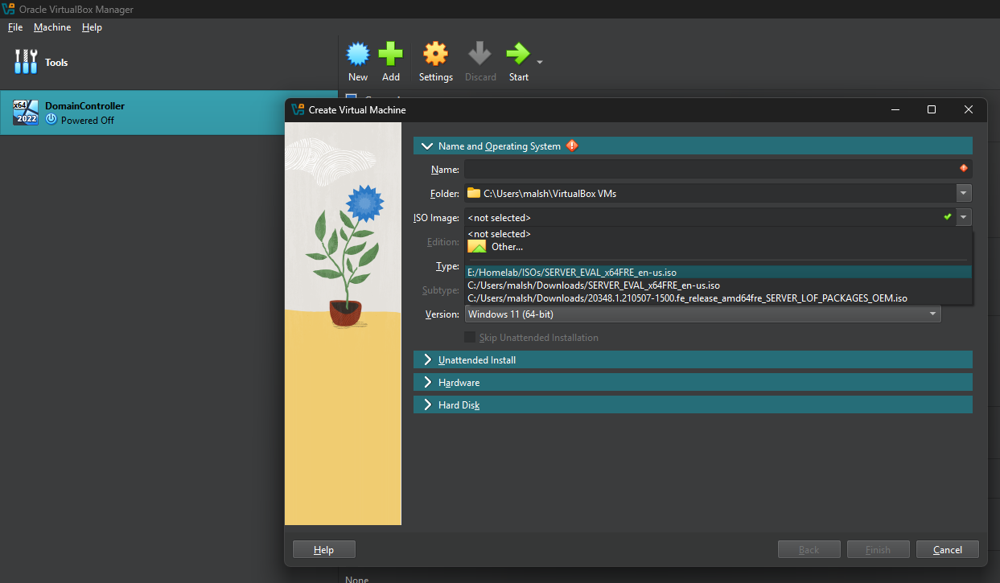
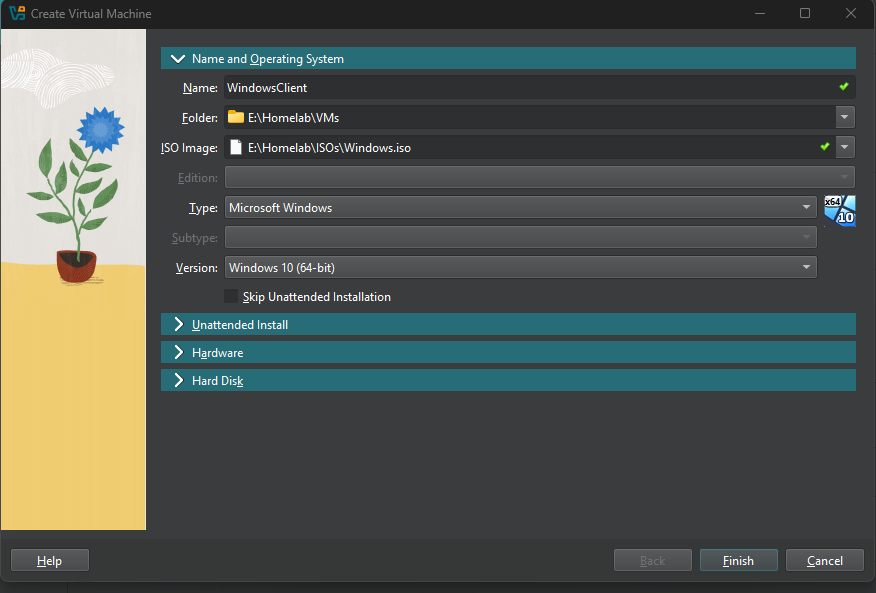
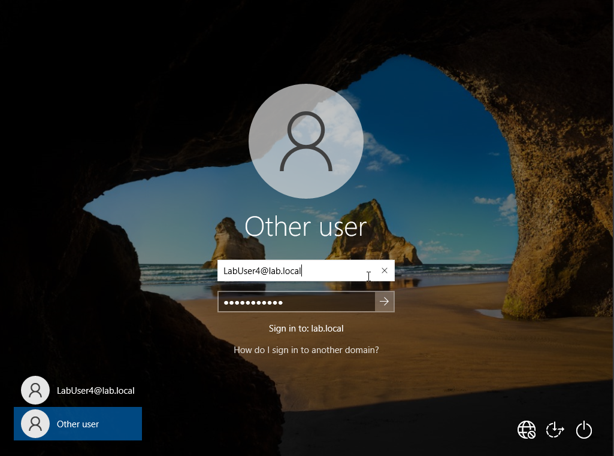
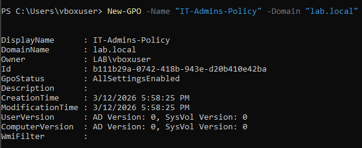
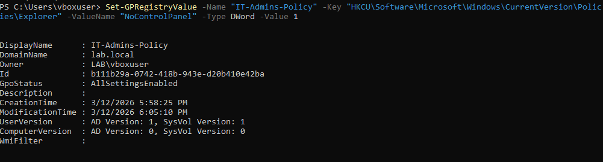
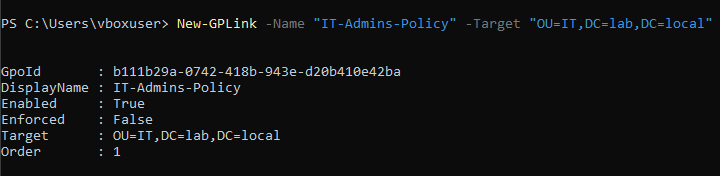
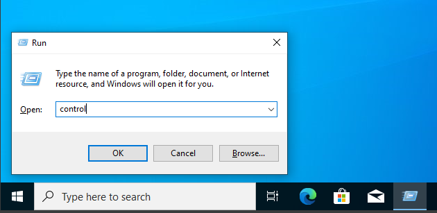
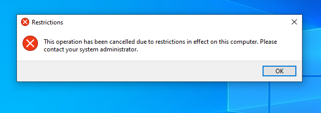

# AD-Home-Lab
This lab simulates a small enterprise Active Directory environment where users, organizational units, and group policies are managed using PowerShell. This details the implementation of my Active Directory home lab, further details and screen captures can be found in the screenshots folder. I Deployed Windows 10 and Windows Server virtual machines on Oracle VirtualBox using ISO installation images.
 

## Virtual Machine Setup
You can install VirtualBox here: https://www.virtualbox.org/wiki/Downloads
Install Windows Server and Windows 10 iso files online lol. When VirtualBox is configured; open VirtualBox, select the new option, select your iso file and destination folder, name your machine, and select finish:

<table style="width:100%">
  <tr>
    <td></td>
    <td></td>
  </tr>
</table>

## Domain Controller Configuration
I configured the domain controller on Windows Server as follows: 
  
  * Domain name - lab.local
  * Computer name - ITDOMAINCONT
  * Network adapter address - 172.16.0.1 (private IPv4 address commonly used in internal LAN environments)
  * Preferred DNS Server - 127.0.0.1 (Loopback address)
  * Alternate DNS Server - Blank
  * Update Setting: Manual
  * Remote Desktop: Enabled

## Organizational Unit Creation
Upon configuring the domain controller, I created an organizational unit to organize accounts:

    New-ADOrganizationalUnit 
    -Name "Users" 
    -Path "DC=lab,DC=local"

## User Account Creation
User accounts were created in PowerShell. Passwords were stored as secure strings.

    $securePass = Read-Host "Enter a secure password:" -AsSecureString

Example user creation command:

    New-ADUser 
    -Name "LabUser1" 
    -GivenName "Lab" 
    -Surname "User1" 
    -SamAccountName "LabUser1" 
    -UserPrincipalName "LabUser1@lab.local" 
    -Enabled $true 
    -AccountPassword $securePass 
    -Path "OU=Users,DC=lab,DC=local"

> 

A user account provisioned here can be used to log into a Windows Client device with the selected credentials:

> 

## Group Policy Implementation:
Group policies were created and linked to organizational units to control user behaviour.
Example: Restricting user access to the control panel:

1. Create the group policy:

       New-GPO 
       -Name "IT-Admins-Policy" 
       -Domain "lab.local"
   
> 
       
2. Define the group policy:
   
       Set-GPRegistryValue 
       -Name "IT-Admins-Policy" 
       -Key "HKCU\Software\Microsoft\Windows\CurrentVersion\Policies\Explorer" 
       -ValueName "NoControlPanel" 
       -Type DWord -Value 1

> 

    3. Link the policy to the desired OU:
       New-GPLink 
       -Name "IT-Admins-Policy" 
       -Target "OU=IT,DC=lab,DC=local"
       
> 

    4. Adding a generic user to this OU enforces the policy on their account:
         Move-ADObject 
         -Identity "CN=LabUser4,CN=Users,DC=lab,DC=local" 
         -TargetPath "OU=IT,DC=lab,DC=local"

> 

When a user is placed inside an OU, any group policies associated to it are automatically applied to the user account. 

<table style="width:100%">
  <tr>
    <td></td>
    <td></td>
  </tr>
</table>

## Password Reset Example
A common help desk task in an Active Directory environment is resetting a user's password. The following is an example of this process:

    $securePass = Read-Host "Enter a secure password:" -AsSecureString
    Set-ADAccountPassword 
    -Identity "LabUser1" 
    -Reset 
    -NewPassword $securePass
    

