# AD-Home-Lab
This lab simulates a small enterprise Active Directory environment where users, organizational units, and group policies are managed using PowerShell. This repository documents the implementation of my Active Directory home lab, further details and screen captures can be found in the screenshots folder. I deployed Windows 10 and Windows Server virtual machines on Oracle VirtualBox using ISO installation images.
<br>

## Virtual Box Setup
You can install VirtualBox here: https://www.virtualbox.org/wiki/Downloads <br>
The installation is relatively straightforward, just select the exe for your operating system and follow the setup instructions provided.

## Virtual Machine Setup
This home lab will make use of two virtual machines. 
1. **Windows Server 2022** - This is where you will configure your domain controller. The domain controller in an Active Directory environment is the central authority responsible for all administrative tasks such as user account provisioning and policy implementation. The ISO installation image for Windows Server can be found at https://www.microsoft.com/en-us/evalcenter/download-windows-server-2022
2. **Windows 10** - This machine will be used to log into provisioned user accounts. Its primary purpose in this lab will be to verify the connection of a client to the lab domain and that implemented policies are active and functional. The ISO installation image for Windows 10 can be found at https://www.microsoft.com/en-ca/software-download/windows10. Select _Download Now_ under _Create Windows 10 Installation Media_, then follow the installation steps and to create and ISO which will be used to set up our virtual machine.

When VirtualBox and both ISO images are installed you can set up your virtual machines. Select _New_, name your VM, navigate to and select the ISO image, and choose a destination folder for your VM, _ex/ \labvms_. Ensure that Unattended install is **unselected** as it is often cause for bugs when setting up your OS in the VM. When both VMs are created, boot them up, verify that they work, and complete the OS installation for each. When you are installing Windows 10 in VirtualBox **MAKE SURE YOU SELECT WINDOWS 10 PRO** otherwise you will not be able to join any domains.

Starting with the Windows 10 machine. Right click the machine in VirtualBox, navigate to Settings > Network. Under _Attached to_ select _Internal Network_. Name the internal network what you like and leave the rest of the settings as they are. Perform the same with the Windows Server VM, then select Adapter 2 and under _Attached to_ select _NAT_, all other settings can remain default. 
<table style="width:100%">
  <tr>
    <td>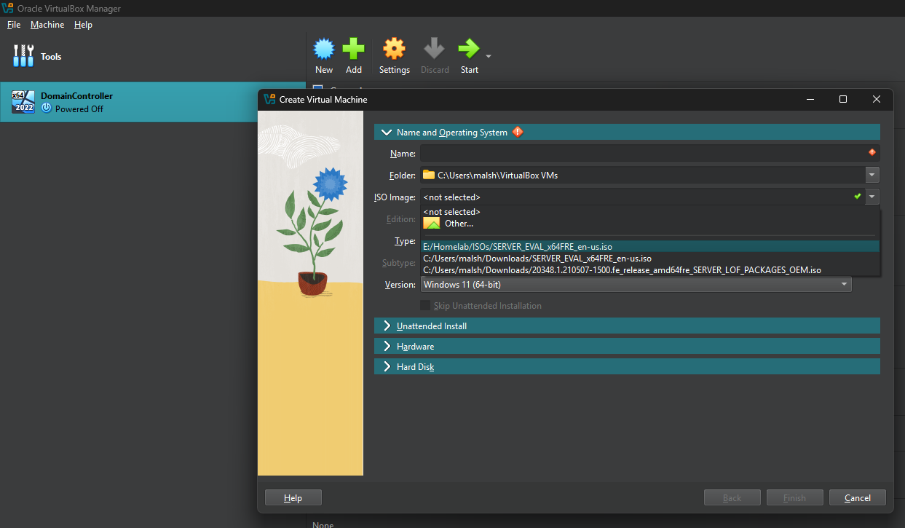</td>
    <td>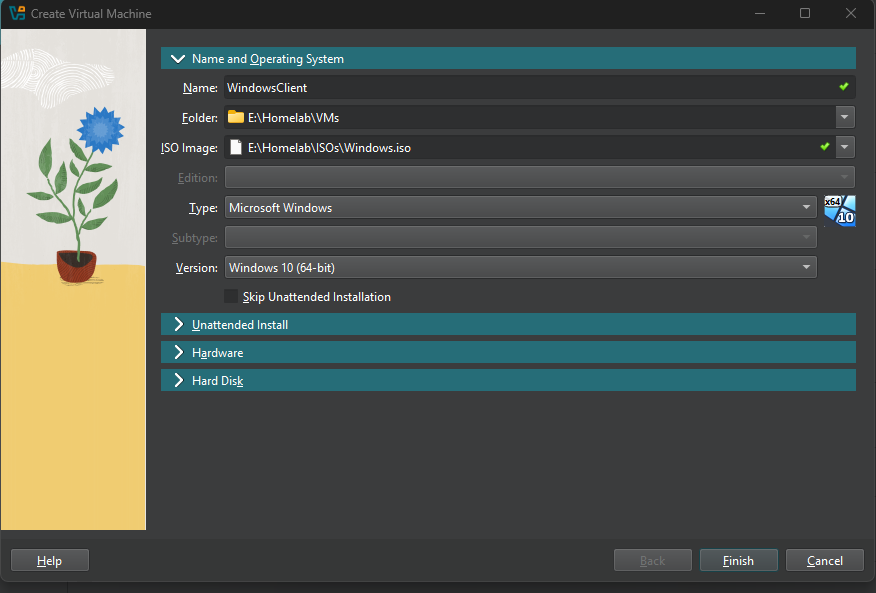</td>
  </tr>
</table>

## Useful Reference Images
The majority of this lab's setup will refer to numbers on the SConfig screen, and there are steps throughout that will require you to authenticate via an authorized/administrator account. Feel free to refer to these images to make your life easier.
> 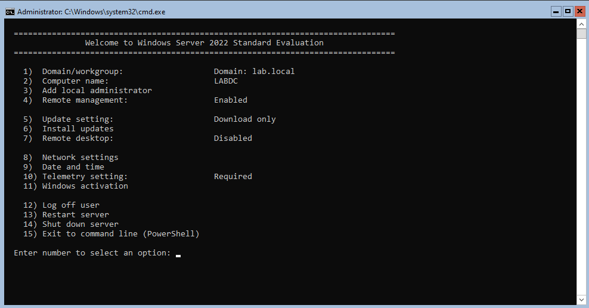
> 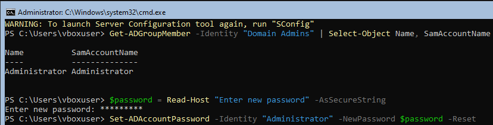 <br>

```powershell
Get-ADGroupMember -Identity "Domain Admins" | Select-Object Name, SamAccountName
```
Ensure the following two commands are run in the same session to preserve the $password variable

```powershell
$password = Read-Host "Enter new password" AsSecureString
```
```powershell
Set-ADAccountPassword -Identity "Administrator" -NewPassword $password -Reset
```
## Active Directory Installation
The following command should be used to install Active Directory and its services.
> 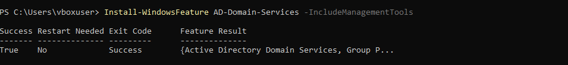

```powershell
Install-WindowsFeature AD-Domain-Services -IncludeManagementTools
```

## Domain Controller Configuration
I configured the domain controller on Windows Server as follows: 
  * **_Update Setting: Manual_** - (SConfig - 5) Enter 'M' to set updates to manual. This will prevent Windows Server from updating and rebooting while you are halfway through your configuration.
  * **_Remote Desktop: Enabled_** - (SConfig - 7) Enter 'E' to enable remote desktop. Select the more secure option. Setting this is best practice for 
system administration. Enabling Remote Desktop allows you to log into the domain controller and perform administrative tasks from Windows client machines.
  * **_Domain name - lab.local_** <br>
  > 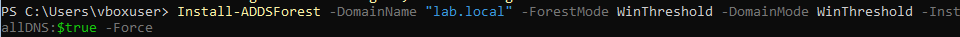

```powershell
Install-ADDSForest -DomainName "lab.local" -ForestMode WinThreshold -DomainMode WinThreshold -InstallDNS:$true -Force
```

This command is used to configure your domain as a forest with lab.local as the root domain. Your machine is no longer viewed as a standalone server, it is promoted to be the domain controller in a hierarchy of servers. This foundation allows for the future expansion into child domains such as dev.lab.local or marketing.lab.local to create a multi-domain tree. WinThreshold is not strictly necessary. It sets the domain's functional level to Windows Server 2016 ensuring that no feature incompatible with Windows Server 2016 or newer will be used. InstallDNS:$true installs the DNS server role, allowing you to configure your domain controller as a DNS server.


  You can now select 1 on the SConfig screen, and join the created domain as follows:
  > 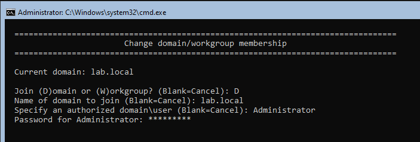
  * **_Computer name - ITDomainCont_**
  Select 2 on SConfig and change the computer name as follows:
  > 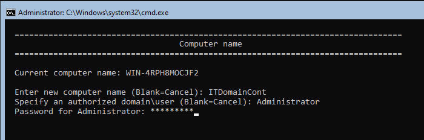
  * **_Network Adapter Address & Preferred DNS Server_**
    Select 8 on SConfig to configure the network addresses. There should be one network adapter present in the Network Settings, type 1 to select this adapter.
  > 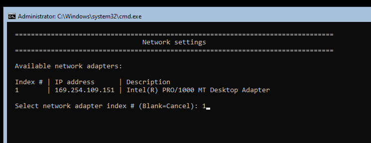 

The preferred DNS server will have been set to the loopback address during the installation of ADDSForest. This is what we want, as our domain controller acts as the DNS server for our entire network.

  > 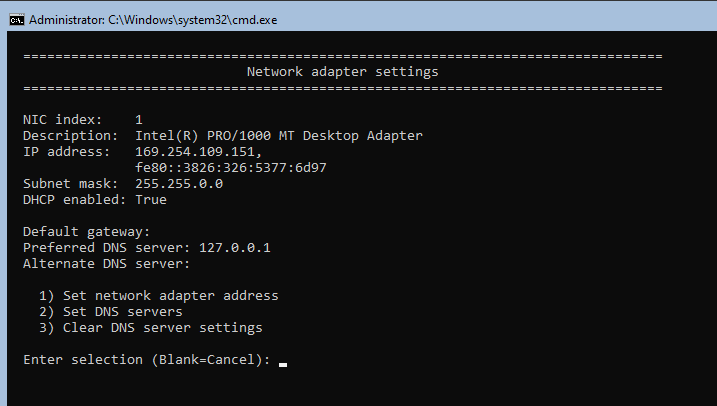

Select 1 on the Network Adapter Settings to set the Network adapter address.

  > 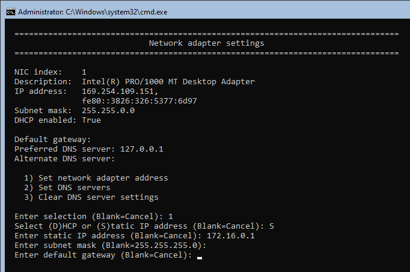

First select Static IP address. Since this is the domain controller it is required that it be at a fixed IP address since it is a point of reference for the entire network. It is recommended that you use 172.16.0.1 for your static IP address. This is a private IPv4 address that is commonly used in internal LAN environments. You may leave the subnet mask and the default gateway blank. Leaving the subnet mask blank defaults to 255.255.255.0, defining the boundary of your network to 172.16.0.X

I have found that the new IP address often does not stick, and that it is better to manually change it via PowerShell. If this is the case for you, you can change the static IP manually via PowerShell with the following commands:

  > 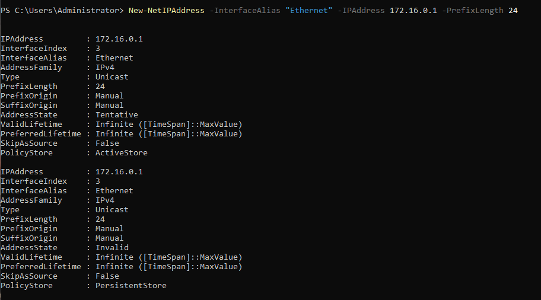

First get the correct Interface Alias: 
```powershell
Get-NetAdapter
```

This command will update to the desired IP:

```powershell
New-NetIPAddress -InterfaceAlias "Ethernet" -IPAddress 172.16.0.1 -PrefixLength 24
```

This change should now be reflected in the Network Settings (8 on SConfig)

  > 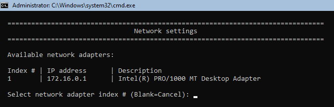

## Connecting your Client Machine to your Domain Controller

Before we attemotNow that we have configured our domain controller, we need to join the domain we created with our Windows client. Log into the Windows 10 machine, navigate to _Network Status_ > _Change adapter options_ > _Ethernet_ > _Properties_. Select _Internet Protocol Version 4 (TCP/IPv4)_ and properties. Then configure _IP Address, Subnet Mask, and Preferred DNS Server_ as follows: 

  > 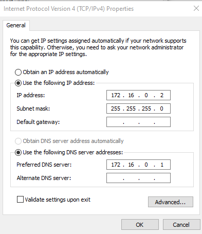
  
  > IP address can be set to any IP in your range other than that of your DNS server, another option might be 172.16.0.102.
  
  > The preferred DNS server must point directly to the DC since it is the DNS server for the entire network.

Search for This PC and select properties. Scroll down and select _Rename this PC (advanced)_. Select _change_ and set the domain to the name of the domain you previously created via the domain controller (ex/ lab.local). With this you should have successfully joined the correct domain. You will be prompted to restart the computer to apply these changes.

  > 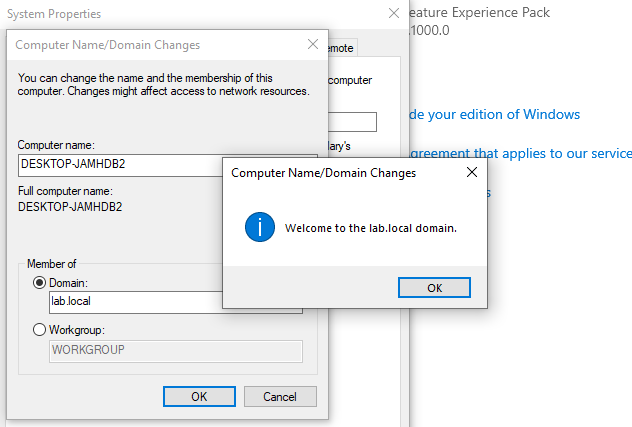

We will further validate that our joining of the domain was successful in the following section.

## User Account Creation
User accounts were created in PowerShell. Passwords were stored as secure strings.

    $securePass = Read-Host "Enter a secure password:" -AsSecureString

Example user creation command:

    New-ADUser 
    -Name "LabUser1" 
    -GivenName "Lab" 
    -Surname "User1" 
    -SamAccountName "LabUser1" 
    -UserPrincipalName "LabUser1@lab.local" 
    -Enabled $true 
    -AccountPassword $securePass 
    -Path "OU=Users,DC=lab,DC=local"

> 

Passwords can be created and assigned to a user in the single user creation command.

    New-ADUser
    -Name "John Smith"
    -GivenName "John"
    -Surname "Smith"
    -SamAccountName "jsmith"
    -UserPrincipalName "jsmith@lab.local"
    -Enabled $true
    -AccountPassword (Read-Host -AsSecureString "Enter a password")
    -Path "OU=Engineering,OU=Departments,DC=lab,DC=local"

If your join of your lab domain was successful, then you can log into your client machine with the credentials of any account provisioned.

> 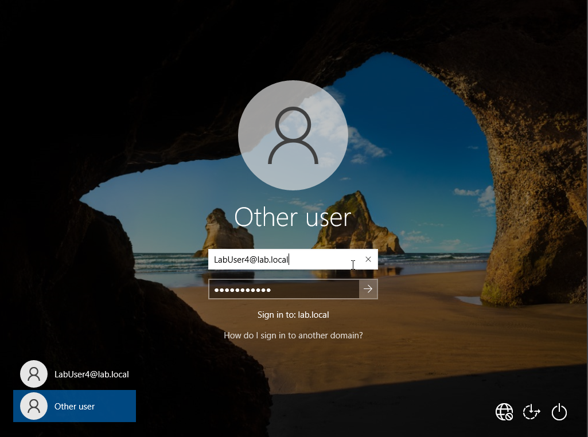

## Bulk User Creation

## Organizational Unit (OU) Creation
Upon configuring the domain controller, I created an OU to hold all user accounts for users in the domain:

    New-ADOrganizationalUnit 
    -Name "Users" 
    -Path "DC=lab,DC=local"

You can place OUs in other OUs by prepending *OU=* to the -Path string. For example you might want to place an *Engineering* OU in a *Departments* OU.

```powershell
New-ADOrganizationalUnit
-Name "Departments"
-Path "DC=lab,DC=local"
```

```powershell
New-ADOrganizationalUnit
-Name "Engineering"
-Path "OU=Departments,DC=lab,DC=local"
```

## Security Grouping

## Group Policy Implementation:
Group policies were created and linked to organizational units to control user behaviour.
Example: Restricting user access to the control panel:

1. Create the group policy:

       New-GPO 
       -Name "IT-Admins-Policy" 
       -Domain "lab.local"
   
> 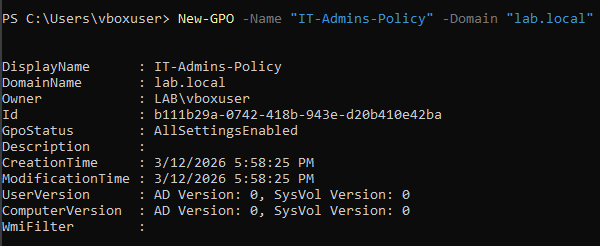
       
2. Define the group policy:
   
       Set-GPRegistryValue 
       -Name "IT-Admins-Policy" 
       -Key "HKCU\Software\Microsoft\Windows\CurrentVersion\Policies\Explorer" 
       -ValueName "NoControlPanel" 
       -Type DWord -Value 1

> 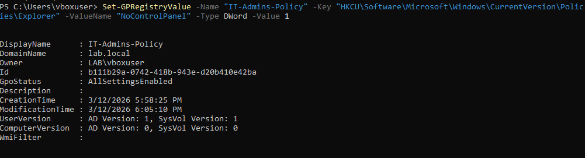

    3. Link the policy to the desired OU:
       New-GPLink 
       -Name "IT-Admins-Policy" 
       -Target "OU=IT,DC=lab,DC=local"
       
> 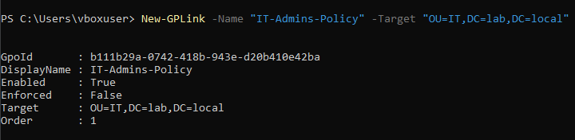

    4. Adding a generic user to this OU enforces the policy on their account:
         Move-ADObject 
         -Identity "CN=LabUser4,CN=Users,DC=lab,DC=local" 
         -TargetPath "OU=IT,DC=lab,DC=local"

> 

When a user is placed inside an OU, any group policies associated to it are automatically applied to the user account. 

<table style="width:100%">
  <tr>
    <td>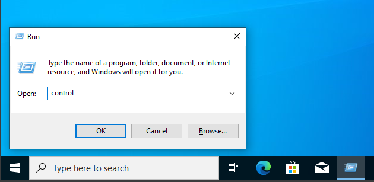</td>
    <td>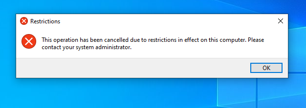</td>
  </tr>
</table>

## Common Administrative tasks

### Password Reset
A common help desk task in an Active Directory environment is resetting a user's password. The following is an example of this process:

    $securePass = Read-Host "Enter a secure password:" -AsSecureString
    Set-ADAccountPassword 
    -Identity "LabUser1" 
    -Reset 
    -NewPassword $securePass

### Password Rotation
In enterprise environments, it is best practice to enforce password resets after a set period of time (ex/30 days, 90 days, 1 year). In AD an admin can enforce a password reset upon a user's next login.

> 

    Set-ADUser
      -Identity "jsmith"
      -ChangePasswordAtLogon $true

While it is possible for an admin to manually reset a password from a DC, this is not best practice since it would involve the admin being aware of the user's password. As such the previous command can be preceded by a standard password reset command in the case that a user forgets their password. This would allow the user a temporary password with which to authenticate before changing their password at login, since the user must know their current password to go through the reset.

```powershell
Set-ADAccountPassword
-Identity "jsmith"
-Reset
-NewPassword (Read-Host -AsSecureString "Enter a temporary password")
```

```powershell
Set-ADUser
-Identity "jsmith"
-ChangePasswordAtLogon $true
```

Now the user will be prompted to change their account the next time they want to log in.


## Common AD Troubleshoots
